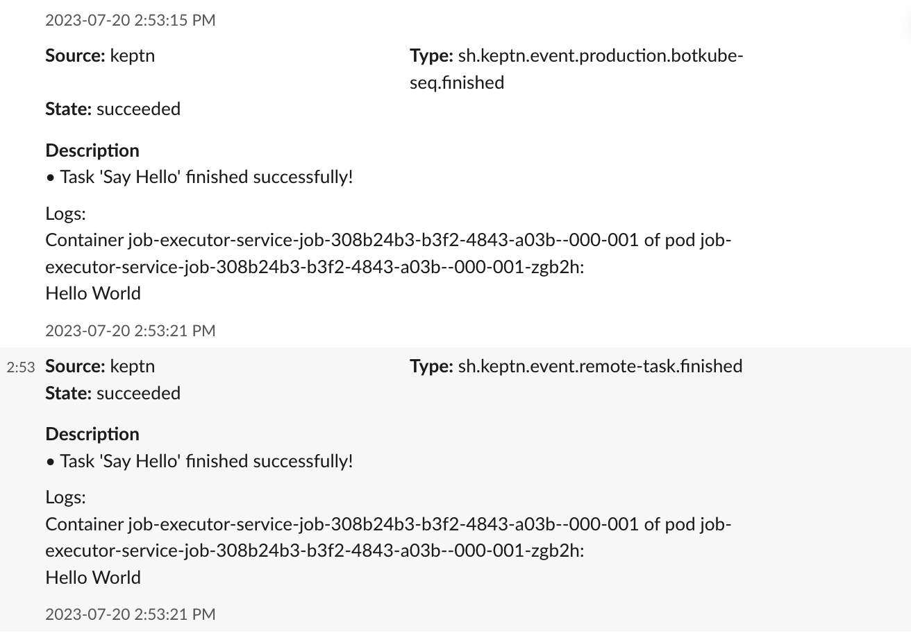

Botkube allows you to consume `keptn` events on your Kubernetes cluster. By default, `keptn` plugin is disabled. See the [**Enabling plugin**](../../configuration/source/keptn#enabling-plugin) section from the `keptn` configuration documentation.

Once it is enabled, Botkube Keptn plugin will consume Keptn events and send them to configured platforms as shown below.

