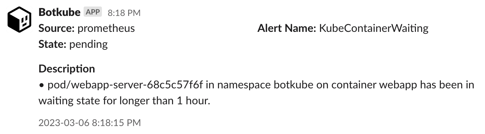

:::info

**This plugin is available as a part of the Botkube Cloud offering.**

Botkube is introducing new plugins with advanced functionality that will be part of the Botkube Team and Enterprise packages. These advanced plugins require cloud services provided by Botkube and are not part of the Botkube open source software.

As part of this change, some of the existing Botkube plugins are being moved to a new repository. This repository requires authentication with a Botkube account. To continue using these Botkube plugins, create an account at https://app.botkube.io/ and configure a Botkube instance, or [migrate an existing installation with the Botkube CLI](../../cli/migrate.md).

:::

Botkube allows you to consume `prometheus` alerts on your Kubernetes cluster. By default, `prometheus` plugin is disabled. See the [**Enabling plugin**](../../configuration/source/prometheus#enabling-plugin) section from the `prometheus` configuration documentation.

Once it is enabled, Botkube Prometheus plugin will consume Prometheus alerts and send them to configured platforms as shown below.

